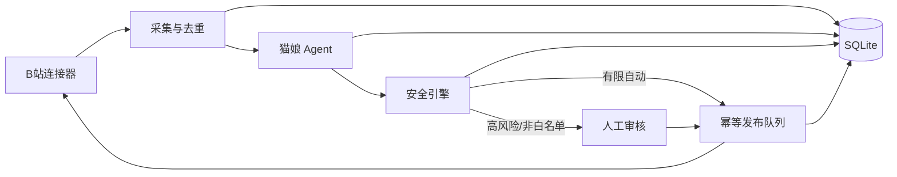

# B站赛博猫娘 v1

一个默认全人工、可审计、可紧急停止的 B站 AI 角色研究基线。模型只生成结构化候选决策；
安全引擎决定是否进入发布队列，发布器负责幂等写入和可见性核验。

## 当前能力

- 公共评论只读采集、事件标准化与去重；
- DeepSeek 兼容接口的结构化猫娘回复决策；
- 分用户记忆、敏感记忆拒绝和提示注入拦截；
- 白名单、频率、风险等级、人工审核和 kill switch；
- 评论回复、图文动态适配器与发布结果核验；
- 定时动态草稿、数据库数字驱动的互动日报；
- 本机审核控制台和端到端离线回放；
- 真实 B站连接器默认只读，写入还需单独打开连接器闸门。

首版不包含直播、私信、视频投稿、AI 生图、多账号、代理池或验证码绕过。

## 架构



## 本机安装

需要 Python 3.11 或 3.12。在项目目录执行：

```powershell
python -m pip install -e '.[dev]'
python -m pytest -q
python -m ruff check src tests
```

配置直接读取进程环境变量，`.env.example` 只是变量清单，不会被应用自动加载。默认配置为：

- `CATGIRL_RUN_MODE=manual_only`
- `CATGIRL_KILL_SWITCH=false`
- `CATGIRL_AUTO_REPLY_ALLOWLIST=`（空白名单）
- SQLite 数据库位于 `data/cyber_catgirl.db`

不要把真实 Cookie 或 API 密钥写入仓库、聊天记录或命令历史。

## 启动控制台

```powershell
python -m uvicorn cyber_catgirl.main:app --host 127.0.0.1 --port 8765
```

浏览器打开 `http://127.0.0.1:8765`，健康检查为
`http://127.0.0.1:8765/api/health`。服务只绑定本机地址，首次启动保持全人工模式。

管理后台包含六个页面：

- `/`：工作台与真实数据概览；
- `/reviews`：逐条审核、编辑、批准或拒绝草稿；
- `/content`：安排定时草稿生成，不直接发布；
- `/analytics`：读取 SQLite 的 7/14 天互动趋势；
- `/logs`：查看发布任务与脱敏审计记录；
- `/settings`：管理运行模式、白名单和轮询间隔。

桌面端使用左侧导航，手机端自动切换为底部导航。右上角“紧急停止”在所有页面可用；
开启后会取消待发布任务。后台本身不会启动真实 B站常驻轮询工作进程。

当前 v1 是研究与试运营基线：控制台、领域服务和调度注册器已经完成，但真实账号的常驻轮询
进程没有默认启动。接入专用测试账号前，先按 `docs/operations.md` 完成凭证、备份、单次写入
探针与人工值守检查。

## 只读连接测试

```powershell
python -m cyber_catgirl.research.connector_probe `
  --oid 170001 `
  --resource-type video `
  --read-only `
  --report .\artifacts\connector-readonly.json
```

命令行探针目前只接受 `--read-only`，因此不能意外发布。已验证结果见
`docs/connector-research.md`。

## 文档

- `docs/operations.md`：启停、恢复、凭证轮换、备份和异常处置；
- `docs/14-day-trial.md`：14 天人工到有限自动试运营门槛；
- `docs/connector-research.md`：真实连接器研究证据与待验证事项。
