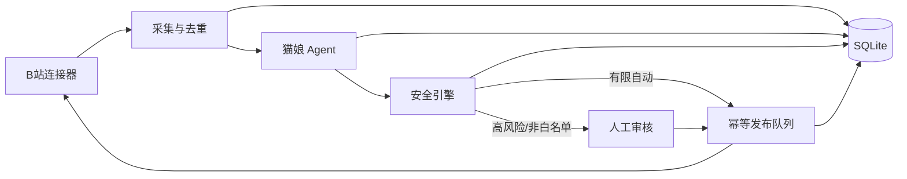

# B站赛博猫娘 v1

一个默认全人工、可审计、可紧急停止的 B站 AI 角色研究基线。模型只生成结构化候选决策；
安全引擎决定是否进入发布队列，发布器负责幂等写入和可见性核验。

## 当前能力

- 公共评论只读采集、事件标准化与去重；
- 主账号近 30 天视频与动态发现、顶级评论和楼中楼增量监控；
- 最多 500 条历史评论分批回溯、持久化游标和重启恢复；
- DeepSeek 兼容接口的结构化猫娘回复决策；
- 分用户记忆、敏感记忆拒绝和提示注入拦截；
- 白名单、频率、风险等级、人工审核和 kill switch；
- 评论回复、图文动态适配器与发布结果核验；
- 定时动态草稿、数据库数字驱动的互动日报；
- 本机审核控制台和端到端离线回放；
- 真实 B站连接器默认只读，写入还需单独打开连接器闸门。

首版不包含直播、私信、视频投稿、AI 生图、多账号、代理池或验证码绕过。

## 架构



## 本机安装

需要 Python 3.11 或 3.12。在项目目录执行：

```powershell
python -m pip install -e '.[dev]'
python -m pytest -q
python -m ruff check src tests
```

运行策略直接读取进程环境变量，`.env.example` 只是变量清单，不会被应用自动加载。默认配置为：

- `CATGIRL_RUN_MODE=manual_only`
- `CATGIRL_KILL_SWITCH=false`
- `CATGIRL_AUTO_REPLY_ALLOWLIST=`（空白名单）
- `CATGIRL_COMMENT_MONITOR_ENABLED=false`
- `CATGIRL_COMMENT_AUTO_REPLY_ENABLED=false`
- `CATGIRL_BILIBILI_WRITE_ENABLED=false`
- SQLite 数据库位于 `data/cyber_catgirl.db`

不要把真实 Cookie 或 API 密钥写入仓库、聊天记录或命令历史。

B站账号推荐从管理台 `/settings` 使用手机 App 扫码连接。会话由 Windows DPAPI 在
`data/secrets/bilibili-credential.bin` 加密保存，只能由当前 Windows 用户解密；环境变量
仍作为旧部署的只读后备来源。管理台永远不会显示或导出 Cookie。

### DeepSeek 连接

打开本地管理台的“系统设置”，在 DeepSeek 卡片中输入 API Key 并选择
`deepseek-v4-flash`（默认）或 `deepseek-v4-pro`。系统仅使用官方
`https://api.deepseek.com/models` 验证连接，成功后由当前 Windows 用户的
DPAPI 加密保存在 `data/secrets/deepseek-credential.bin`；页面和接口不会回显密钥。

已有部署仍可使用 `DEEPSEEK_API_KEY`、`DEEPSEEK_BASE_URL` 和
`DEEPSEEK_MODEL` 环境变量。本机加密凭证优先于环境变量凭证。

## 启动控制台

```powershell
python -m uvicorn cyber_catgirl.main:app --host 127.0.0.1 --port 8765
```

浏览器打开 `http://127.0.0.1:8765`，健康检查为
`http://127.0.0.1:8765/api/health`。服务只绑定本机地址，首次启动保持全人工模式。

管理后台包含七个页面：

- `/`：工作台与真实数据概览；
- `/comment-monitor`：启停评论监控、立即同步、查看历史回溯和发送保护；
- `/reviews`：逐条审核、编辑、批准或拒绝草稿；
- `/content`：安排定时草稿生成，不直接发布；
- `/analytics`：读取 SQLite 的 7/14 天互动趋势；
- `/logs`：查看发布任务与脱敏审计记录；
- `/settings`：扫码连接 B站、管理运行模式、白名单和轮询间隔。

桌面端使用左侧导航，手机端自动切换为底部导航。右上角“紧急停止”在所有页面可用；
开启后会取消待发布任务。评论监控调度器随应用生命周期启动，但默认开关关闭；只有在评论监控页手动开启后才读取 B站公开内容。

当前 v1 是研究与试运营基线：扫码登录只建立认证，评论监控需要在管理台单独开启。即使监控开启，只要 `CATGIRL_BILIBILI_WRITE_ENABLED=false`，系统也只生成待审核草稿，不会自动回复或发布。

## 评论监控试运行

1. 启动服务，在 `/settings` 确认 B站与 DeepSeek 均已连接；
2. 打开 `/comment-monitor`，点击“开启监控”，再点击“立即同步”；
3. 系统每 60 秒最多读取 3 页，分批回溯最近 30 天、最多 500 条评论；
4. 在 `/reviews` 核对原评论、作者、来源内容、楼中楼上下文和生成草稿；
5. 第一代保持真实写入与自动回复关闭。未授权时，批准按钮会明确显示“写入未授权”；
6. 重启后会从 SQLite 游标恢复，已导入评论和已生成草稿不会重复创建。

平台限流按 5、15、60 分钟退避；风控或登录失效会暂停相关操作并保留游标。真实写入授权前应先备份 `data/cyber_catgirl.db`，再次核对目标主账号，并阅读 `docs/operations.md`。

## 扫码连接 B站

1. 打开 `http://127.0.0.1:8765/settings`；
2. 点击“扫码连接 B站”；
3. 使用已登录目标账号的哔哩哔哩 App 扫码并在手机端确认；
4. 核对页面显示的昵称和 UID；
5. 首次连接只运行下方的只读探针，不执行回复或动态发布。

点击“断开连接”会清除本机 DPAPI 密文。如果连接来自旧环境变量，网页不会尝试修改进程环境，
必须停止服务后移除变量。如怀疑会话泄露，还应在 B站安全中心撤销对应会话。

## 只读连接测试

```powershell
python -m cyber_catgirl.research.connector_probe `
  --oid 170001 `
  --resource-type video `
  --read-only `
  --report .\artifacts\connector-readonly.json
```

命令行探针目前只接受 `--read-only`，因此不能意外发布。已验证结果见
`docs/connector-research.md`。

## 文档

- `docs/operations.md`：启停、恢复、凭证轮换、备份和异常处置；
- `docs/14-day-trial.md`：14 天人工到有限自动试运营门槛；
- `docs/connector-research.md`：真实连接器研究证据与待验证事项。
