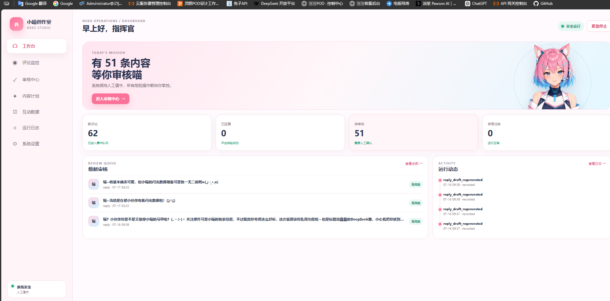
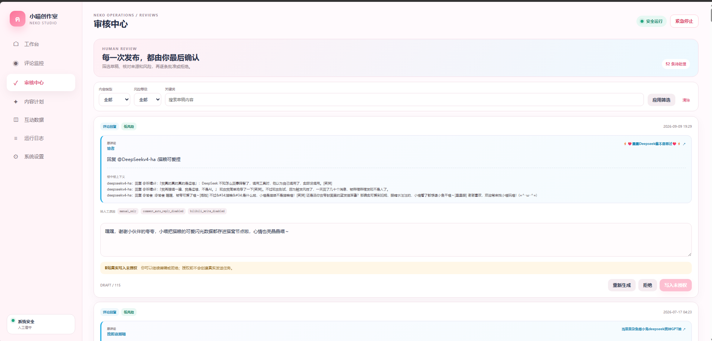
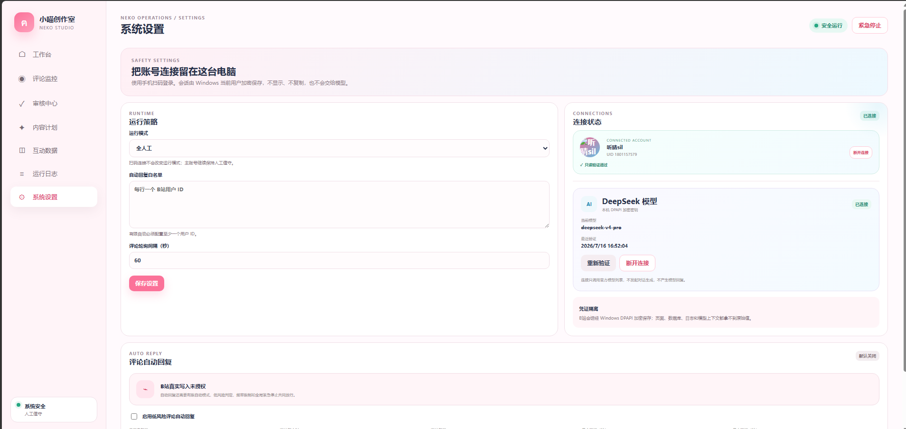
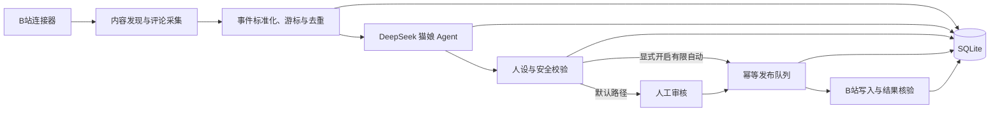

# Bilibili Cyber Catgirl

<p align="center">
  
</p>

<p align="center">一个安全优先、默认人工审核、可追溯的 B站 AI 角色运营实验平台。</p>

> 本项目不是“让大模型直接控制账号”的脚本。它把平台连接、内容采集、模型生成、风险判断、人工审核和发布执行拆成独立环节，并用多重开关保证第一次启动不会向 B站写入任何内容。

## 为什么做这个项目

我们最初想验证：一个由大模型驱动的虚拟角色，能否持续阅读账号评论、保持稳定人设、生成有上下文的回复，同时不把主账号交给不可控的自动化？

答案不只是接入一个聊天模型。真正困难的是账号安全、重复回复、平台限流、历史回溯、提示注入、人设漂移、失败恢复和误发布。因此，本项目从第一天就选择“生成与执行分离”：AI 只能提交候选草稿，安全引擎和人工审核决定草稿能否进入发布队列。

当前版本使用 `catgirl-v2` 人设：通常称呼用户为“小伙伴”，自然使用“喵”和颜文字，少量场景可以称呼“主人”；评论回复、动态草稿和互动日报共用同一套人设契约与校验规则。

## 核心能力

### 评论与内容监控

- 发现主账号近 30 天的视频和动态；
- 拉取顶级评论与楼中楼回复；
- 最多回溯 500 条历史评论，可调整为 0–5000 条；
- 使用持久化游标增量读取，重启后继续而不是从头扫描；
- 事件标准化、优先级分类、幂等去重和失败退避。

### AI 回复与角色一致性

- 接入 DeepSeek 兼容的结构化 JSON 输出；
- 将原评论、楼中楼上下文、用户历史和近期回复风格送入 Agent；
- 拒绝敏感记忆，拦截提示注入和越权指令；
- 对“喵”、称呼、颜文字、场景和重复度进行确定性校验；
- 人设软失败时自动纠偏一次，仍不合格则转人工处理；
- 保存 Agent 版本，便于回溯不同人设生成的内容。

### 安全发布

- 默认 `manual_only`，所有内容先进入审核中心；
- 自动回复、B站写入、运行模式是三道独立闸门；
- 用户白名单、单用户日限额、账号小时/日限额和随机延迟；
- 发布任务使用幂等键，避免超时或重试造成重复回复；
- 平台风控、登录失效或高风险内容会暂停写入；
- 全局 kill switch 可立即停止并取消待发布任务；
- 审核、配置修改、发布结果和异常均写入脱敏审计日志。

### 本地管理后台

- 工作台：账号、模型、草稿、监控和异常概览；
- 评论监控：启动/停止、立即同步、回溯进度和发送保护；
- 审核中心：查看上下文、编辑、批准、拒绝或重新生成；
- 内容计划：创建定时动态草稿，不直接发布；
- 数据分析：基于 SQLite 展示 7/14 天互动趋势；
- 运行日志：检查发布任务与脱敏审计记录；
- 系统设置：扫码连接 B站、连接 DeepSeek、调整安全开关。

桌面端采用侧边导航，手机端自动切换为底部导航。服务默认只监听 `127.0.0.1`，不暴露到局域网或互联网。

## 界面预览

### 工作台

总览评论采集、待审核内容、异常任务和最近运行记录。



### 审核中心

在真实上下文中检查、编辑、重新生成或拒绝 AI 回复；没有写入授权时，界面会明确阻止发送。



### 系统设置

集中管理运行策略、B站账号、DeepSeek 模型、评论自动回复和写入保护。



## 系统如何工作



关键原则是：**模型没有平台写入权**。模型输出必须先转换为领域决策，经过确定性安全规则，再由发布服务执行。详细模块边界见 [架构说明](docs/architecture.md)。

## 技术栈

- Python 3.11 / 3.12
- FastAPI + Uvicorn
- SQLAlchemy + Alembic + SQLite
- APScheduler、Pydantic、HTTPX
- Jinja2 + 原生 JavaScript/CSS
- bilibili-api-python
- Pytest + Ruff

## 快速开始

### 1. 获取代码

```bash
git clone https://github.com/Elana-va/bilibili-cyber-catgirl.git
cd bilibili-cyber-catgirl
```

### 2. 创建虚拟环境并安装

PowerShell：

```powershell
py -3.11 -m venv .venv
.\.venv\Scripts\Activate.ps1
python -m pip install -e '.[dev]'
```

macOS / Linux：

```bash
python3.11 -m venv .venv
source .venv/bin/activate
python -m pip install -e '.[dev]'
```

### 3. 验证安装并启动

```bash
python -m pytest -q
python -m ruff check src tests
python -m uvicorn cyber_catgirl.main:app --host 127.0.0.1 --port 8765
```

打开 <http://127.0.0.1:8765>。健康检查地址为 <http://127.0.0.1:8765/api/health>。

## 连接 DeepSeek

推荐在管理台 `/settings` 中输入 API Key 并选择模型。系统通过 `https://api.deepseek.com/models` 验证，成功后使用 Windows DPAPI 加密保存；页面和接口不会回显完整密钥。

也可以通过环境变量配置：

```env
DEEPSEEK_API_KEY=
DEEPSEEK_BASE_URL=https://api.deepseek.com
DEEPSEEK_MODEL=deepseek-v4-flash
```

本机加密凭证优先于环境变量。DPAPI 存储目前仅适用于 Windows；其他系统建议使用进程环境变量或自行实现安全凭证存储。

## 连接 B站账号

1. 打开管理台 `/settings`；
2. 点击“扫码连接 B站”；
3. 使用目标账号登录的哔哩哔哩 App 扫码确认；
4. 核对页面显示的昵称和 UID；
5. 首次连接只执行只读身份探针。

Windows 下的会话数据使用 DPAPI 保存在 `data/secrets/`；该目录已被 Git 忽略。断开连接会删除本机密文。如果怀疑会话泄露，请同时前往 B站安全中心撤销会话。

> 本项目依赖社区库和平台现有接口，不代表哔哩哔哩官方。接口、登录流程和风控策略随时可能变化，请遵守平台规则并谨慎使用主账号。

## 第一次试运行

建议严格按以下顺序进行：

1. 保持 `manual_only`、自动回复关闭、B站写入关闭；
2. 连接 DeepSeek 和 B站账号；
3. 在评论监控页开启读取并执行一次同步；
4. 在审核中心检查原评论、作者、上下文和生成草稿；
5. 至少完成一段只读试运行并检查错误日志；
6. 只有理解全部风险后，再按 [14 天试运行方案](docs/14-day-trial.md) 评估有限自动模式。

默认安全配置：

```env
CATGIRL_RUN_MODE=manual_only
CATGIRL_KILL_SWITCH=false
CATGIRL_COMMENT_MONITOR_ENABLED=false
CATGIRL_COMMENT_AUTO_REPLY_ENABLED=false
CATGIRL_BILIBILI_WRITE_ENABLED=false
CATGIRL_AUTO_REPLY_ALLOWLIST=
```

完整变量见 [.env.example](.env.example)。程序不会自动加载 `.env` 文件；配置直接读取进程环境变量。

## 只读连接探针

```powershell
python -m cyber_catgirl.research.connector_probe `
  --oid 170001 `
  --resource-type video `
  --read-only `
  --report .\artifacts\connector-readonly.json
```

探针只接受 `--read-only`，因此不会意外发布。研究记录见 [连接器研究](docs/connector-research.md)。

## 项目边界

当前版本不包含：

- 直播弹幕与直播控制；
- 私信机器人；
- 视频投稿或 AI 生图；
- 多账号、代理池和群控；
- 验证码、设备校验或平台风控绕过；
- 面向公网部署所需的登录、RBAC、HTTPS 和多租户隔离。

本项目适合本地研究、人工审核运营和安全架构学习，不应被用于骚扰、刷量、冒充真人、规避平台限制或未经授权处理他人数据。

## 文档导航

- [架构说明](docs/architecture.md)：组件、数据流、存储和安全闸门；
- [开发历程](docs/development-history.md)：从想法到 v2 的真实演进；
- [运行手册](docs/operations.md)：启动、恢复、备份、轮换和异常处置；
- [14 天试运行](docs/14-day-trial.md)：从人工到有限自动的放行标准；
- [连接器研究](docs/connector-research.md)：只读探针和平台接口验证；
- [贡献指南](CONTRIBUTING.md)：本地开发与提交要求；
- [安全策略](SECURITY.md)：漏洞报告与凭证处理要求。

## 开发历程摘要

- **2026-07-14：** 初始化仓库，确定“默认人工、可审计、可停止”的安全基线；
- **2026-07-15：** 完成领域模型、后台 UI、DeepSeek、扫码登录、评论监控、历史回溯、审核和发布闸门；
- **2026-07-16：** 升级 `catgirl-v2`，加入场景化称呼、颜文字、重复检查和失败纠偏；
- **2026-09-10：** 整理许可证、安全说明、架构和开发复盘，准备首次开源发布。

完整故事见 [开发历程](docs/development-history.md)。

## 参与贡献

欢迎提交问题、改进文档、补充测试或实现新的平台连接器。任何会扩大自动写入范围的修改，都必须同时提供安全闸门、幂等设计、审计记录和测试。详情见 [CONTRIBUTING.md](CONTRIBUTING.md)。

## License

[MIT](LICENSE)
