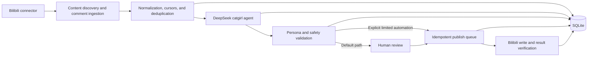

<p align="center">
  
</p>

<p align="center">
  <a href="README.md">简体中文</a> · <strong>English</strong>
</p>

<h1 align="center">Bilibili Cyber Catgirl</h1>

<p align="center">
  <strong>Let an LLM sustain a character—without surrendering control of a real account.</strong>
</p>

<p align="center">
  
  
  
  
  
  <a href="LICENSE"></a>
</p>

<p align="center">
  <a href="#quick-start"><strong>Quick Start</strong></a> ·
  <a href="#interface-preview"><strong>Interface</strong></a> ·
  <a href="docs/architecture.en.md"><strong>Architecture</strong></a> ·
  <a href="docs/development-history.en.md"><strong>Development History</strong></a> ·
  <a href="docs/operations.md"><strong>Operations</strong></a> ·
  <a href="SECURITY.md"><strong>Security</strong></a>
</p>


## Start Here

> **First run:** [Install and launch](#quick-start) · [Connect DeepSeek](#connect-deepseek) · [Connect Bilibili](#connect-a-bilibili-account) · [Run safely](#first-safe-trial)

> **Understand the system:** [Motivation](#why-this-project-exists) · [Capabilities](#core-capabilities) · [Data flow](#how-it-works) · [Full development history](docs/development-history.en.md)

> **Contribute:** [Architecture and boundaries](docs/architecture.en.md) · [Contribution guide](CONTRIBUTING.md) · [Security reporting](SECURITY.md)

## Project Timeline

| Stage | Product evolution | Traceable record |
|---|---|---|
| 2026-07-14 | Established a manual-by-default, auditable, emergency-stoppable baseline | [Safety baseline](docs/development-history.en.md#2026-07-14-safety-before-features) |
| 2026-07-15 | Built the console, QR login, DeepSeek integration, comment backfill, review flow, and write gates | [Complete local console](docs/development-history.en.md#2026-07-15-from-domain-skeleton-to-a-complete-console) |
| 2026-07-16 | Introduced `catgirl-v2`, scene-aware persona validation, and corrective regeneration | [Persona as a contract](docs/development-history.en.md#2026-07-16-from-a-prompt-to-a-versioned-persona-contract) |
| 2026-09-10 | Completed the public documentation, security audit, and first GitHub release | [Full history](docs/development-history.en.md) |

> This is not a script that hands an account directly to an LLM. Platform access, ingestion, generation, deterministic safety checks, human review, and publishing are separate stages. A fresh installation cannot write anything to Bilibili by default.

## Why This Project Exists

The original question was simple: can an LLM-driven virtual character continuously read comments, stay in character, and write contextual replies without turning a primary social account into an uncontrolled automation target?

Generating a cute sentence is the easy part. The hard parts are account safety, duplicate prevention, platform rate limits, historical backfill, prompt injection, persona drift, partial failures, recovery, and accidental publishing. This project therefore treats generation as a proposal—not as permission to act.

The current persona is `catgirl-v2`. It normally addresses users as “小伙伴” (friend/partner), uses “喵” and emoticons naturally, and may use “主人” (master) only in limited scenes. Replies, dynamic-post drafts, and interaction reports share the same versioned persona rules.

## Core Capabilities

### Comment and content monitoring

- Discover videos and dynamic posts published by the connected account in the last 30 days;
- Read top-level comments and nested replies;
- Backfill up to 500 historical comments by default, configurable from 0 to 5,000;
- Persist pagination cursors and resume after process restarts;
- Normalize, prioritize, deduplicate, and retry events with controlled backoff.

### AI replies and persona consistency

- Use DeepSeek-compatible structured JSON output;
- Ground generation in the source comment, thread context, user history, and recent style history;
- Reject sensitive memories and defend against prompt injection and privilege escalation;
- Validate wording, forms of address, emoticons, scene fit, and repetition deterministically;
- Regenerate once with explicit corrective feedback after a soft persona failure;
- Route unresolved failures to human review and record the generating agent version.

### Guarded publishing

- Default to `manual_only`; all generated content enters the review center;
- Keep run mode, auto-reply, and Bilibili write authorization as three independent gates;
- Apply allowlists, per-user daily limits, account hourly/daily limits, and randomized delay;
- Use idempotency keys to prevent duplicate replies after timeouts or retries;
- Stop writes on platform risk-control signals, expired credentials, or high-risk content;
- Provide a global kill switch that cancels pending publish jobs;
- Record review actions, configuration changes, publish results, and failures in redacted audit logs.

### Local operations console

- **Dashboard:** account, model, drafts, monitoring, and failure overview;
- **Comment Monitor:** start/stop, sync now, backfill progress, and write protection;
- **Review Center:** inspect context, edit, approve, reject, or regenerate;
- **Content Plans:** schedule draft generation without direct publishing;
- **Analytics:** 7/14-day interaction trends backed by SQLite;
- **Runtime Logs:** publish jobs and redacted audit records;
- **Settings:** Bilibili QR login, DeepSeek connection, run mode, and safety controls.

The service binds to `127.0.0.1` by default. The current console is intended for a single local operator, not direct internet exposure.

## Interface Preview

### Review Center

Review AI output in its real thread context. Without explicit write authorization, the interface blocks publishing.


### System Settings

Manage the runtime policy, Bilibili account, DeepSeek model, auto-reply policy, and write protection in one place.


## How It Works



The central rule is simple: **the model never owns platform write access**. Its output becomes a domain decision, passes deterministic policy, and is executed only by the publishing service. See the [architecture guide](docs/architecture.en.md) for module and data boundaries.

## Technology Stack

- Python 3.11 / 3.12;
- FastAPI and Uvicorn for the local service;
- SQLAlchemy, Alembic, and SQLite for durable state;
- APScheduler for monitoring and content schedules;
- Pydantic and HTTPX for validated boundaries and HTTP integration;
- Jinja2 plus vanilla JavaScript/CSS for the console;
- bilibili-api-python for the community-maintained platform adapter;
- Pytest and Ruff for verification.

## Quick Start

### Clone and install

PowerShell:

```powershell
git clone https://github.com/Elana-va/bilibili-cyber-catgirl.git
cd bilibili-cyber-catgirl
py -3.11 -m venv .venv
.\.venv\Scripts\Activate.ps1
python -m pip install -e '.[dev]'
```

macOS / Linux:

```bash
git clone https://github.com/Elana-va/bilibili-cyber-catgirl.git
cd bilibili-cyber-catgirl
python3.11 -m venv .venv
source .venv/bin/activate
python -m pip install -e '.[dev]'
```

### Verify and launch

```bash
python -m pytest -q
python -m ruff check src tests
python -m uvicorn cyber_catgirl.main:app --host 127.0.0.1 --port 8765
```

Open <http://127.0.0.1:8765>. The health endpoint is <http://127.0.0.1:8765/api/health>.

## Connect DeepSeek

Use `/settings` to enter an API key and choose a model. The application verifies the connection against `https://api.deepseek.com/models`, then protects the credential with Windows DPAPI. The UI and API never echo the complete key.

Environment variables remain available:

```env
DEEPSEEK_API_KEY=
DEEPSEEK_BASE_URL=https://api.deepseek.com
DEEPSEEK_MODEL=deepseek-v4-flash
```

Local encrypted credentials take precedence. DPAPI storage is Windows-specific; on other operating systems, use process environment variables or provide an appropriate secret store.

## Connect a Bilibili Account

1. Open `/settings`;
2. Select “扫码连接 B站” (connect by QR code);
3. Scan and confirm with the target account in the Bilibili mobile app;
4. Verify the displayed nickname and UID;
5. Let the application run its read-only identity probe.

On Windows, session credentials are DPAPI-encrypted under `data/secrets/`, which is ignored by Git. Disconnecting removes the local ciphertext. If a session may be compromised, revoke it in Bilibili's security center as well.

> This is an independent project that relies on a community library and currently available platform interfaces. It is not an official Bilibili product. APIs, login flows, and risk-control behavior may change; follow platform rules and use primary accounts cautiously.

## First Safe Trial

1. Keep `manual_only`, auto-reply off, and Bilibili writes off;
2. Connect DeepSeek and Bilibili;
3. Enable read monitoring and perform one sync;
4. Inspect the source, author, thread context, and draft in the Review Center;
5. Complete a read-only trial and inspect failures before considering writes;
6. Use the [14-day trial plan](docs/14-day-trial.md) before evaluating limited automation.

Safe defaults:

```env
CATGIRL_RUN_MODE=manual_only
CATGIRL_KILL_SWITCH=false
CATGIRL_COMMENT_MONITOR_ENABLED=false
CATGIRL_COMMENT_AUTO_REPLY_ENABLED=false
CATGIRL_BILIBILI_WRITE_ENABLED=false
CATGIRL_AUTO_REPLY_ALLOWLIST=
```

See [.env.example](.env.example) for all variables. The application reads the process environment and does not automatically load `.env`.

## Read-only Connector Probe

```powershell
python -m cyber_catgirl.research.connector_probe `
  --oid 170001 `
  --resource-type video `
  --read-only `
  --report .\artifacts\connector-readonly.json
```

The probe only accepts `--read-only`, so it cannot accidentally publish. See [connector research](docs/connector-research.md) for the recorded findings.

## Scope and Limitations

The current version does not include live-stream control, direct messages, video uploads, AI image generation, multi-account control, proxy pools, CAPTCHA bypass, device-verification bypass, or public deployment security such as authentication, RBAC, HTTPS, and tenant isolation.

This repository is suitable for local research, human-reviewed operations, and safety architecture study. Do not use it for harassment, engagement manipulation, impersonation, platform-limit evasion, or unauthorized processing of personal data.

## Documentation

- [Architecture](docs/architecture.en.md)
- [Development history](docs/development-history.en.md)
- [Operations runbook (Chinese)](docs/operations.md)
- [14-day trial plan (Chinese)](docs/14-day-trial.md)
- [Connector research (Chinese)](docs/connector-research.md)
- [Contributing (Chinese)](CONTRIBUTING.md)
- [Security policy (Chinese)](SECURITY.md)

## Contributing and Security

Contributions to reliability, tests, documentation, observability, persona quality, and new platform connectors are welcome. Any change that expands write access must include a disabled-by-default setting, server-side authorization checks, idempotency, rate-limit handling, redacted auditing, kill-switch behavior, and tests.

Never submit real cookies, API keys, user databases, or identifiable private data. Report vulnerabilities privately through GitHub Security Advisories, as described in [SECURITY.md](SECURITY.md).

## License

[MIT](LICENSE)
