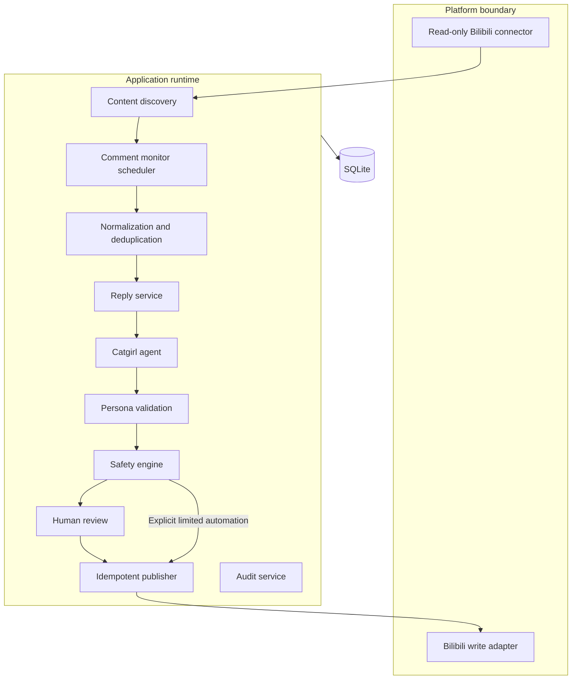
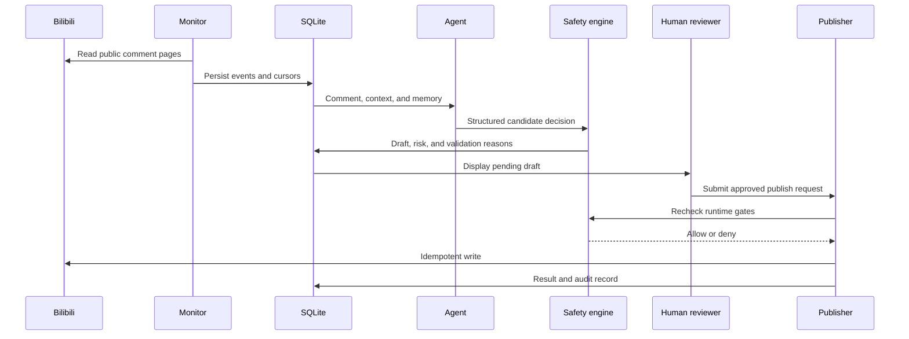

# System Architecture

<a href="architecture.md">简体中文</a> · <strong>English</strong>

This document describes the boundaries, data flow, safety model, and extension strategy implemented by Bilibili Cyber Catgirl today.

## 1. Design Goals

1. **Separate generation from execution:** the LLM cannot call platform write APIs directly;
2. **Deny writes by default:** a fresh installation can only produce human-review drafts;
3. **Make the workflow recoverable:** cursors, generation state, and publish jobs are durable;
4. **Make important actions traceable:** operations are recorded in redacted audit logs.

## 2. System Overview

## 3. Component Responsibilities

### Platform connectors

`src/cyber_catgirl/connectors/` isolates Bilibili-specific behavior. `base.py` defines read and publish ports, `bilibili_api.py` adapts content, comments, nested replies, and writes, `bilibili_login.py` manages QR login, and `fake.py` supplies deterministic test doubles.

Services depend on ports rather than third-party SDK types. A platform change can therefore be handled inside the connector, while new platforms can reuse the rest of the system.

### Discovery and monitoring

`content_discovery.py` discovers videos and dynamic posts. `comment_monitor.py` reads comment pages using durable checkpoints. `monitor_runtime.py` owns scheduling, backoff, and runtime state.

Every platform item is normalized into an event before persistence. A unique platform event ID prevents repeated reads from creating duplicate drafts.

### Agent and persona

The agent receives the event, thread context, and scoped memory, then asks the model for a JSON-Schema-constrained decision. The model may propose whether to reply, draft text, risk signals, and memory candidates; it cannot authorize execution.

`persona.py` defines the `catgirl-v2` contract. `persona_validation.py` checks use of “喵,” forms of address, emoticons, scene fit, joke intensity, and similarity to recent replies. A soft failure receives one corrective regeneration; hard or repeated failures go to human review.

### Memory

`memory.py` stores only short, low-sensitivity preferences useful for future interactions. Memories are isolated by user and may expire. Passwords, contact details, addresses, payment data, and other sensitive content are rejected.

### Safety and review

`safety.py` combines risk, run mode, allowlists, rate limits, the kill switch, and write authorization. Human review is always the default route.

The Review Center exposes source context and permits editing, approval, rejection, or regeneration. Approval does not bypass the publisher's final policy check.

### Publisher

`publishing.py` is the only service allowed to invoke the write port. Every job has a unique idempotency key. Successful writes store the platform ID and verify visibility. Platform limits use 5-, 15-, and 60-minute backoff. Expired credentials, risk-control signals, and terminal failures stop further writes and retain stable error codes.

### Web console

`web/` contains FastAPI routes, Jinja2 templates, view models, and static assets. Pages call services rather than connectors directly. The current console is designed for one local operator and does not include authentication or authorization required for public hosting.

## 4. Data Model

| Table | Purpose | Key constraint |
|---|---|---|
| `monitored_contents` | Videos and dynamic posts under monitoring | Unique platform content ID |
| `monitor_checkpoints` | Pagination cursors and backfill progress | Unique checkpoint key |
| `events` | Normalized comment events | Unique platform event ID |
| `drafts` | Reply, dynamic-post, and report drafts | Stores agent version and review state |
| `publish_jobs` | Recoverable publish attempts | Unique idempotency key |
| `messages` | User-scoped conversation history | Queried by actor ID |
| `memories` | Low-sensitivity long-term memory | Unique user and normalized text |
| `audit_logs` | Redacted operational records | Minimal necessary detail |
| `daily_metrics` | Daily interaction metrics | Unique date |
| `scheduled_content` | Draft-generation schedules | Unique schedule key |
| `system_settings` | Durable runtime settings | Unique setting key |

Alembic manages schema changes. Runtime data, backups, logs, and credentials live under `data/`, which is entirely excluded from Git.

## 5. Comment Lifecycle

## 6. Three Independent Write Gates

Real automatic replies require all of the following:

1. `CATGIRL_RUN_MODE=limited_auto`;
2. `CATGIRL_COMMENT_AUTO_REPLY_ENABLED=true`;
3. `CATGIRL_BILIBILI_WRITE_ENABLED=true`.

The kill switch, allowlist, risk level, rate limits, credential state, and platform risk control must also pass. The intentional friction makes it difficult to turn a test installation into a real publisher accidentally.

## 7. Credentials and Privacy

- Bilibili cookies and DeepSeek keys do not enter SQLite;
- Windows credentials are protected with DPAPI;
- The console does not provide secret echo or export endpoints;
- upstream failures are sanitized before logging;
- `.env`, `data/`, `artifacts/`, and virtual environments are ignored by Git.

## 8. Failure and Recovery

- **Process restart:** continue from durable cursors and job states;
- **Model timeout:** record a stable code, retry under policy, or route to a human;
- **Repeated event:** reject it through database uniqueness;
- **Publish timeout:** use idempotency and visibility checks to reduce duplicates;
- **Platform rate limit:** back off instead of retrying tightly;
- **Expired credential:** pause the affected capability and require authorization;
- **Unexpected write risk:** cancel pending work through the kill switch.

The operational procedures are documented in the [Chinese runbook](operations.md).

## 9. Testing Strategy

Fake connectors, HTTP transports, and temporary SQLite databases cover structured model output, persona correction, comment pagination and recovery, deduplication, memory, safety policy, review actions, idempotent publishing, backoff, QR login, secret protection, the admin console, and offline end-to-end flows. Tests do not require real credentials or call the live Bilibili write interface.

## 10. Adding Another Platform

A new platform should provide a connector and reuse the event, agent, safety, review, and publishing layers. The connector must define authorization, read/write capability, normalized event mapping, idempotency, rate-limit and credential-error classification, a read-only probe, and offline tests. Platform-specific behavior should not be placed in the agent or web pages.
