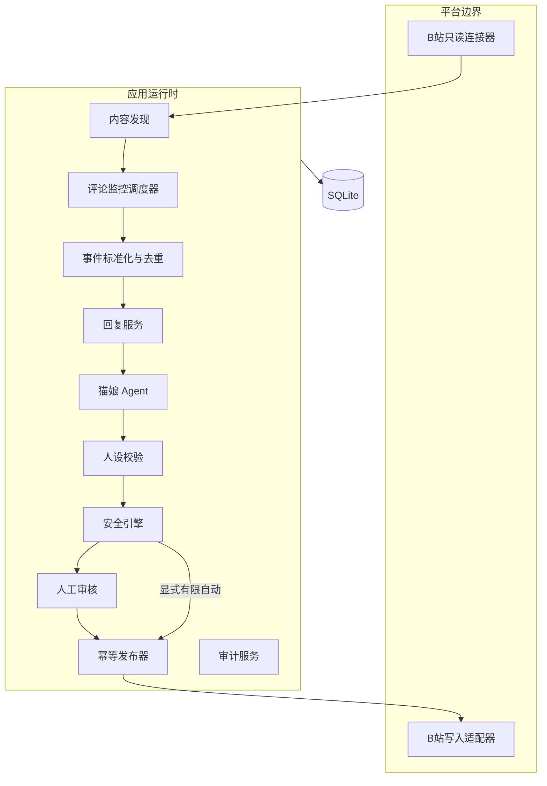
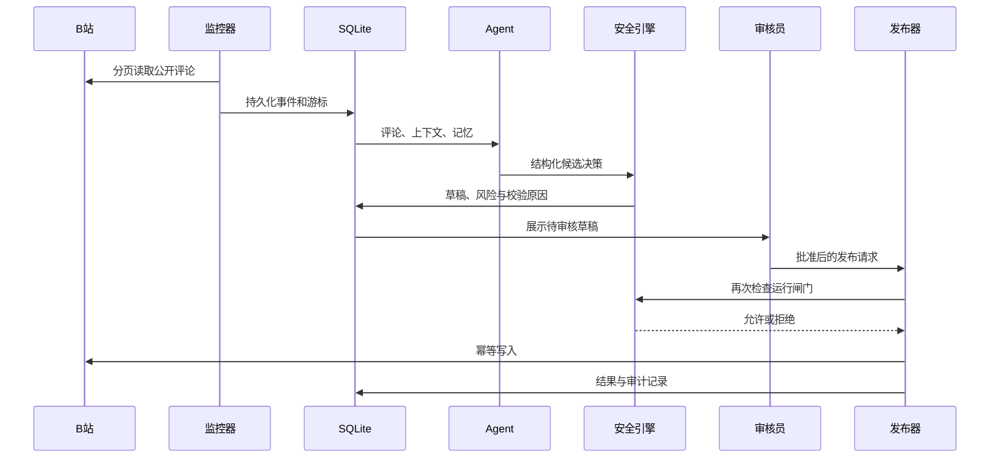

# 系统架构

本文描述 Bilibili Cyber Catgirl 当前实现的模块边界、数据流、安全模型和扩展方式。

## 1. 设计目标

1. **生成与执行分离**：大模型不能直接调用平台写接口；
2. **默认不写入**：新环境第一次启动只能生成人工审核草稿；
3. **全过程可恢复**：采集游标、生成状态和发布任务均持久化；
4. **每一步可追溯**：重要操作进入脱敏审计日志。

## 2. 总体结构

## 3. 模块职责

### 平台连接器

`src/cyber_catgirl/connectors/` 隔离 B站实现：`base.py` 定义读取和发布端口，`bilibili_api.py` 适配内容、评论、楼中楼和发布，`bilibili_login.py` 管理扫码登录，`fake.py` 为测试提供可控替身。

服务层只依赖端口，不依赖第三方 SDK 的具体数据结构。平台接口变化时可以局部替换连接器，也为未来增加其他平台保留边界。

### 采集与监控

`content_discovery.py` 发现视频与动态，`comment_monitor.py` 根据持久化检查点读取评论，`monitor_runtime.py` 负责任务调度、失败退避和运行状态。

采集结果先转换为统一事件，再写入数据库。平台事件 ID 有唯一约束，同一评论被重复读取也不会重复生成草稿。

### Agent 与人设

Agent 接收事件、上下文和记忆，要求模型返回符合 JSON Schema 的结构化决策。模型负责提出“是否回复、回复内容、风险提示和可记忆信息”，但不负责授权。

`persona.py` 定义 `catgirl-v2` 契约，`persona_validation.py` 检查“喵”、称呼、颜文字、场景、玩笑强度和近期回复重复度。软失败携带原因重新生成一次；硬失败或二次失败转人工处理。

### 记忆

`memory.py` 只保存短、低敏感、与后续互动有关的用户偏好。记忆按用户隔离并支持过期时间。密码、联系方式、地址、支付信息等不会进入长期记忆。

### 安全与审核

`safety.py` 综合风险级别、运行模式、白名单、频率限制、kill switch 和写入授权决定草稿去向。默认路径永远是人工审核。

审核中心允许运营者查看来源与上下文、编辑、批准、拒绝或重新生成。批准也不会绕过发布器的最终安全检查。

### 发布器

`publishing.py` 是唯一允许调用写入端口的服务。每个任务拥有唯一幂等键；成功后保存平台返回 ID 并核验可见性。平台限流采用 5、15、60 分钟退避，登录失效或风控会停止写入并保留错误码。

### Web 管理后台

`web/` 包含 FastAPI 路由、Jinja2 模板、视图模型和静态资源。页面只调用服务层，不直接操作平台连接器。当前后台面向本机单用户，不包含公网部署所需的身份认证与权限系统。

## 4. 数据模型

| 表 | 用途 | 关键约束 |
|---|---|---|
| `monitored_contents` | 被监控的视频与动态 | 平台内容 ID 唯一 |
| `monitor_checkpoints` | 分页游标和回溯进度 | 检查点键唯一 |
| `events` | 标准化评论事件 | 平台事件 ID 唯一 |
| `drafts` | 回复、动态和日报草稿 | 保存 Agent 版本和审核状态 |
| `publish_jobs` | 可恢复的发布任务 | 幂等键唯一 |
| `messages` | 用户级对话历史 | 按 actor ID 查询 |
| `memories` | 低敏感长期记忆 | 用户与标准化文本联合唯一 |
| `audit_logs` | 脱敏操作记录 | 只记录必要信息 |
| `daily_metrics` | 每日互动指标 | 日期唯一 |
| `scheduled_content` | 定时草稿计划 | 计划键唯一 |
| `system_settings` | 可持久化运行设置 | 设置键唯一 |

Alembic 管理结构升级。运行数据、备份、日志和凭证位于 `data/`，整个目录不会进入 Git。

## 5. 一条评论的生命周期

## 6. 三道写入闸门

真实自动回复至少需要同时满足：

1. `CATGIRL_RUN_MODE=limited_auto`；
2. `CATGIRL_COMMENT_AUTO_REPLY_ENABLED=true`；
3. `CATGIRL_BILIBILI_WRITE_ENABLED=true`。

此外还要通过 kill switch、白名单、风险级别、频率限制、凭证状态和平台风控检查。任何一项不满足都会阻止发送。这种设计故意增加开启自动化的摩擦，避免一次误操作把测试环境变成真实发布环境。

## 7. 凭证与隐私

- B站 Cookie 和 DeepSeek Key 不进入 SQLite；
- Windows 使用 DPAPI 加密本地凭证；
- 管理台不提供密钥回显或导出接口；
- 异常信息经过清洗，避免密钥进入日志；
- `.env`、`data/`、`artifacts/` 和虚拟环境均被 Git 忽略。

## 8. 故障与恢复

- **进程重启**：从 SQLite 游标和任务状态继续；
- **模型超时**：记录稳定错误码，按策略重试或交给人工；
- **重复事件**：数据库唯一约束阻止重复草稿；
- **发布超时**：幂等键和结果核验降低重复回复风险；
- **平台限流**：分级退避；
- **凭证失效**：暂停相关能力并要求重新授权；
- **异常写入风险**：kill switch 取消待发布任务。

操作细节见 [运行手册](operations.md)。

## 9. 测试策略

测试使用假连接器、HTTP Mock 和临时数据库覆盖 Agent、人设、评论分页与回溯、去重、记忆、安全策略、审核、幂等发布、平台退避、扫码登录、凭证保护、管理页面和端到端离线流程。测试默认不调用真实 B站写接口，也不需要真实密钥。

## 10. 扩展新平台

支持新平台时应新增连接器并复用事件、Agent、安全、审核和发布层。连接器必须定义授权方式、读写能力、统一事件映射、幂等策略、限流/风控错误分类以及只读探针。不要把平台特殊逻辑直接写进 Agent 或 Web 页面。
