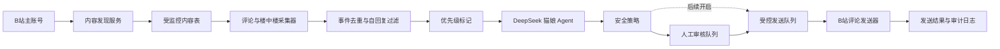

# B站评论监控与 AI 回复系统设计

日期：2026-07-15
状态：用户已确认总体方案，等待书面规格复核

## 1. 目标

在已经连接的 B站主账号与 DeepSeek 模型基础上，建设可持续运行的评论运营系统：

- 发现主账号发布的视频、文字动态和图文动态；
- 每 60 秒调度一次评论监控；
- 采集顶级评论与楼中楼回复；
- 首次回溯最近 30 天内容，最多导入 500 条评论；
- 为新评论生成符合猫娘人设的 DeepSeek 回复草稿；
- 当前阶段所有回复默认进入人工审核；
- 同时铺设自动回复通道，但默认关闭真实自动发送；
- 保证去重、重启续跑、限速、失败退避和全程审计。

系统后续可以增加微信连接器，但本规格只包含 B站评论闭环，不实现微信和 MCP 工具层。

## 2. 已确认的产品规则

### 2.1 监控范围

- 账号：当前已连接的主账号；
- 内容：视频、文字动态、图文动态；
- 评论：顶级评论和所有已发现的楼中楼；
- 历史范围：内容发布时间位于最近 30 天；
- 历史上限：顶级评论与楼中楼合计最多 500 条，按评论时间从新到旧导入；
- 实时调度：每 60 秒触发一次监控任务；
- 自己账号发布的评论不进入生成队列，避免自我回复循环。

### 2.2 审核与优先级

- 当前运行模式保持 `manual_only`；
- 每条有效评论先生成草稿，再由人工编辑、批准或拒绝；
- 包含问号、疑问表达、@账号或明确提及账号名称的评论标记为优先审核；
- 优先级只影响排序，不绕过安全检查，也不自动决定是否回复；
- 模型返回 `IGNORE` 时不创建空草稿，而是把事件标记为已忽略并记录原因；
- 模型调用失败时保留事件，进入可重试状态。

### 2.3 自动回复通道

自动回复是后续主路径，因此第一代同步实现配置、判断、发送队列和审计边界，但默认关闭真实发送。允许发送必须同时满足：

1. 全局模式为 `limited_auto`；
2. 评论自动回复开关为开启；
3. B站真实写入闸门为开启；
4. 紧急停止开关为关闭；
5. B站登录凭证有效；
6. 评论不是账号自己发布的；
7. 未命中提示词注入、严重敏感主题、隐私泄露或刷屏特征；
8. 模型返回有效的 `REPLY`，风险等级为低，且没有请求人工复核；
9. 回复文本不为空且不超过 180 字；
10. 未超过用户级和账号级限速。

自动回复不再要求用户白名单。初始可调限额为：

- 同一用户每天最多自动回复 10 条；
- 整个账号每小时最多自动回复 60 条；
- 整个账号每天最多自动回复 300 条；
- 自动发送任务之间加入 8～20 秒随机间隔。

上述数值是产品侧保护上限，不代表平台保证安全。出现平台限流或风控时，平台错误优先于配置上限，系统立即退避或停止写入。

## 3. 方案选择

采用“进程内持久化监控”方案：FastAPI 服务启动时同时管理 APScheduler，任务状态和游标保存在数据库中。

选择理由：

- 能直接复用现有 SQLAlchemy、APScheduler、采集、草稿、安全和审计模块；
- 相比独立队列服务，更符合第一代单机管理台的规模；
- 相比手动同步，可以满足持续监控与重启续跑；
- 任务状态落库，未来拆成独立 Worker 时不需要推翻数据模型。

暂不采用：

- 独立消息队列和多 Worker：可靠性更强，但第一代部署和运维成本过高；
- 完全依赖模型调用 MCP 工具：适合通用 Agent，但不负责评论游标、去重、审核、限速和稳定调度；
- 纯手动同步：实现简单，但不满足持续监控目标。

## 4. 总体架构



平台连接器只负责 B站数据读取、标准化和发送。调度、游标、生成、安全、审核与审计属于平台无关的应用层，方便后续增加微信等渠道。

## 5. 组件设计

### 5.1 内容发现服务

职责：枚举当前账号最近 30 天的视频和动态，并转换成统一的评论目标。

统一目标至少包含：

- 平台内容 ID；
- 展示类型：`video`、`dynamic_text` 或 `dynamic_draw`；
- B站评论资源的 `oid/rid`；
- 评论资源类型：`video`、`article`、`dynamic` 或 `dynamic_draw`；
- 标题或摘要；
- 发布时间；
- 是否启用监控；
- 最近发现时间、最近轮询时间和下次允许轮询时间。

动态的展示类型与评论接口资源类型分开保存。某些图文或新版动态可能映射到专栏评论资源，不能仅凭页面外观猜测资源类型。

服务启动后进行一次内容发现，之后每 10 分钟刷新一次。手动“立即同步”也会先执行内容发现。

### 5.2 评论与楼中楼采集器

每个目标按评论时间从新到旧拉取顶级评论；发现顶级评论存在回复时，再分页获取楼中楼。统一事件增加：

- `root_comment_id`：所属根评论；
- `parent_comment_id`：直接回复对象；
- `target_id` 与资源类型；
- 评论作者 ID、昵称、内容和平台创建时间；
- 内容标题或摘要；
- 是否为账号自己发布。

顶级评论的 `root_comment_id` 等于自身评论 ID，`parent_comment_id` 为空。楼中楼同时保存根评论和直接父评论，为后续准确回复目标楼层做准备。

事件继续使用平台评论 ID 形成唯一 `event_id`。数据库唯一约束作为最终去重保障，重复抓取只更新监控统计，不重复生成草稿。

### 5.3 调度与请求预算

APScheduler 通过 FastAPI 生命周期启动和停止，禁止同一监控任务重叠执行，并对错过的周期进行合并。

每个 60 秒周期的默认预算：

- 最多读取 1 页内容发现结果；
- 最多读取 3 页评论或楼中楼；
- 最多处理 20 个待生成事件；
- DeepSeek 生成并发最多 2 个；
- 未完成工作留到下一个周期，不通过突发请求追赶。

目标选择使用“最久未轮询优先”，同时优先处理最近发布、最近有新评论的内容。首次 500 条回溯与实时监控共享请求预算，实时新评论优先于历史回溯。

### 5.4 优先级标记

优先级使用确定性规则计算，不额外消耗模型调用。满足任一条件即标为 `priority`：

- 包含 `?` 或 `？`；
- 包含“请问、怎么、为什么、能否、可以吗、是什么”等疑问表达；
- @当前账号；
- 明确提及当前账号名称。

其他评论标为 `normal`。后台默认按“优先级、评论时间”排序。

### 5.5 DeepSeek 草稿生成

发送给模型的上下文仅包括：

- 当前公开评论文本与作者显示名；
- 必要的父评论或根评论上下文；
- 来源内容的标题、摘要和类型；
- 经过筛选的用户记忆；
- 猫娘角色规则和结构化输出约束。

严禁把 B站 Cookie、账号 UID、DeepSeek API Key、加密文件内容或内部异常堆栈发送给模型。

回复长度策略：

- 普通互动通常为 15～50 字；
- 明确问题通常为 40～120 字；
- 复杂问题可以更长，但超过 180 字只能进入人工审核；
- 不应仅靠句尾添加“喵”体现人设，应保持固定称呼、语气、边界和适度表情；
- 除非用户明确询问技术实现，不主动泄露系统内部架构和凭证信息。

### 5.6 安全判断与发送

现有 `SafetyEngine` 改为组合可配置策略：运行模式、总开关、内容风险、模型风险、限速、写入授权和平台状态分别给出原因码。

人工批准的草稿也必须经过：

- 紧急停止检查；
- B站写入授权检查；
- 幂等键检查；
- 账号与平台级发送频率检查。

发送任务使用 `reply:<event_id>` 作为幂等键。楼中楼发送器接收 `oid`、资源类型、根评论 ID 与直接父评论 ID；不能继续用单一 `comment_id` 模糊两种关系。

第一代上线时：

- `run_mode=manual_only`；
- `comment_auto_reply_enabled=false`；
- B站连接器 `write_enabled=false`，直至单独确认真实写入；
- 自动回复策略和队列可以通过模拟连接器完成测试，但不自动向真实账号发送。

## 6. 数据模型与迁移

项目已包含 Alembic 依赖，但当前依赖 `create_all`。本功能需要为现有数据库建立可重复的版本迁移，升级前备份 `data/cyber_catgirl.db`，不得要求用户重新登录或重新输入 DeepSeek Key。

新增表：

### `monitored_contents`

- `id`
- `platform_content_id`，唯一
- `display_type`
- `comment_oid`
- `resource_type`
- `title`
- `published_at`
- `active`
- `last_discovered_at`
- `last_polled_at`
- `next_poll_at`
- `failure_count`

### `monitor_checkpoints`

- `id`
- `checkpoint_key`，唯一
- `cursor_value`
- `state_json`
- `updated_at`

检查点分别保存视频发现、动态发现、各内容顶级评论和各根评论楼中楼进度。

现有表扩展：

- `events`：增加 `priority`、`processing_attempts`、`next_attempt_at`、`last_error_code`；完整楼层关系继续放在版本化事件 JSON 中；
- `drafts`：增加 `safety_reasons_json`、`updated_at`；
- `publish_jobs`：增加 `source`、`next_attempt_at`、`last_error_code`、`completed_at`；
- `system_settings`：保存监控开关、回溯配置、自动回复开关和可调限额。

所有错误字段只保存稳定错误码和脱敏摘要，不保存 Cookie、API Key 或完整上游响应。

## 7. 事件状态与任务状态

评论事件状态：

```text
new
→ generating
→ drafted / ignored / generation_failed
→ drafted（重试成功）
```

草稿审核状态：

```text
pending
→ approved / rejected
→ auto_approved（仅在自动回复全部闸门开启时）
```

发送任务状态：

```text
pending
→ sending
→ succeeded / retry_wait / failed / cancelled
```

`sending` 状态在服务异常退出后可根据租约超时恢复为 `retry_wait`，但重新发送前必须先检查幂等记录和可验证的平台结果。

## 8. 管理台与 API

### 8.1 评论监控页面

展示：

- 监控是否启用；
- B站与 DeepSeek 连接状态；
- 最近同步、下次调度、当前退避状态；
- 已发现内容、历史回溯进度、今日新增评论；
- 待生成、待审核、发送失败和平台异常数量；
- “立即同步”和“暂停监控”操作。

### 8.2 回复审核页面

每张审核卡展示：

- 原评论、作者、评论时间；
- 来源视频或动态及可打开的 B站链接；
- 根评论和必要的楼中楼上下文；
- 优先标签和风险原因；
- DeepSeek 建议回复；
- 编辑、重新生成、批准发送、拒绝操作。

批准发送属于真实外部写操作。第一代在真实写入闸门关闭时，按钮应明确显示“写入未授权”，不得静默假成功。

### 8.3 自动回复设置

展示但默认关闭：

- 自动回复总开关；
- 每用户每日、账号每小时和账号每日上限；
- 回复间隔范围；
- 今日已自动回复数量；
- 紧急停止状态。

任何扩大权限或开启真实自动回复的操作都写入审计日志。

建议 API 边界：

- `GET /api/comment-monitor/status`
- `POST /api/comment-monitor/start`
- `POST /api/comment-monitor/stop`
- `POST /api/comment-monitor/sync`
- `GET /api/reply-drafts`
- `POST /api/reply-drafts/{id}/regenerate`
- `POST /api/reply-drafts/{id}/approve`
- `POST /api/reply-drafts/{id}/reject`
- `GET /api/auto-reply/settings`
- `PATCH /api/auto-reply/settings`

写操作沿用本地管理台边界，并校验请求来源；响应不返回任何凭证或内部密文路径。

## 9. 错误处理与退避

- B站 429 或等价限流：按 5、15、60 分钟递增退避；成功一次后逐步恢复；
- B站风控或账号异常：立即暂停真实写入，记录审计事件，并在管理台高亮；
- B站凭证失效：停止读取和写入，保留游标与待处理数据，提示重新登录；
- 单个内容不存在或评论关闭：停用该目标，不影响其他内容；
- DeepSeek 超时或 5xx：事件进入 `generation_failed`，按 1、5、15 分钟重试，最多 3 次后留给人工重新生成；
- DeepSeek 401、余额或模型不可用：暂停新的模型任务并显示明确连接错误；
- 结构化输出无效：算作模型生成失败，不创建空草稿；
- 数据库唯一约束冲突：视为重复事件或重复任务，不上升为系统故障；
- 调度任务重叠：跳过新一轮并记录指标，不并发扫描同一游标；
- 服务重启：从数据库检查点恢复，不重新执行已成功任务。

## 10. 测试策略

### 10.1 单元测试

- 视频和不同动态类型转换成正确评论目标；
- 顶级评论与楼中楼标准化，根评论和父评论关系正确；
- 自己账号的评论被过滤；
- 评论 ID 去重；
- 问题、@和账号名称触发优先级；
- 500 条和 30 天回溯边界；
- `IGNORE`、模型异常和无效 JSON 的状态转换；
- 自动回复全部闸门与每个拒绝原因；
- 60/小时、300/天和单用户 10/天限速；
- 发送幂等与楼中楼目标参数；
- 退避计算和重启恢复。

### 10.2 集成测试

- 使用模拟 B站 SDK 完成内容发现、评论采集、草稿生成、审核与发送任务闭环；
- 使用模拟 DeepSeek 客户端验证并发上限和失败重试；
- 使用临时 SQLite 数据库验证迁移、重启续跑和唯一约束；
- FastAPI 生命周期正确启动和停止调度器；
- API 和页面不泄露 Cookie、API Key、密文路径与上游响应头；
- 原有 B站登录、DeepSeek 连接、草稿和管理台回归测试保持通过。

### 10.3 人工验收

1. 在管理台开启评论监控，不开启真实写入；
2. 发现主账号最近 30 天的视频和动态；
3. 分批导入不超过 500 条历史评论；
4. 新评论在正常情况下于下一到两个轮询周期内出现；
5. 顶级评论和楼中楼显示正确来源及上下文；
6. 问题和 @ 评论排在优先位置；
7. DeepSeek 生成猫娘回复草稿；
8. 编辑、重新生成和拒绝操作生效；
9. 写入未授权时批准发送不会触发真实 B站操作；
10. 重启服务后继续原有游标且不产生重复草稿；
11. 模拟限流、登录失效和模型失败时，后台显示明确状态并按规则恢复。

## 11. 第一代完成标准

- 主账号内容发现、30 天/500 条回溯和 60 秒监控稳定运行；
- 顶级评论与楼中楼均能去重入库；
- DeepSeek 草稿生成、优先排序和人工审核闭环可用；
- 自动回复配置与安全闸门完整，但默认不真实自动发送；
- 数据迁移不破坏现有 B站登录和 DeepSeek 加密凭证；
- 服务重启、重复抓取和临时接口失败不会造成重复回复；
- 自动化测试与人工验收全部通过后，才单独评估开启真实写入。
